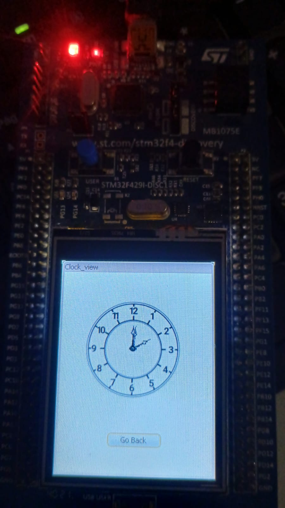

# Analog-Clock-STemWin-for-STM32F429-disc1
This is an analog clock display for the stm32f429 disc1 dev board screen
The project is based on the STemWin (segger) library.

This is how it looks

  

This is the clock working

  

